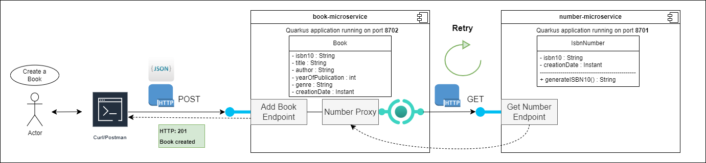

# Quarkus Book Microservices POC

This repository contains two Quarkus microservices that demonstrate how microservice architectures work.  
The book microservice offers the option of adding a book and must call a number microservice to generate the ISBN number as an attribute of a book.   Typical for microservice architectures, a retry and fallback behavior was also implemented in the event of a service failure.

Each of the services is built with Quarkus, the Supersonic Subatomic Java Framework. If you want to learn more about Quarkus, please
visit its website: https://quarkus.io/.

<u>Why microservices?</u>  
Microservices architectures simplify scalability and reduce the development time of applications, enable innovation and shorten the time to market for new functions.

## Clarification 

The following diagram illustrates how the book-microservice works and how it interacts with the number-microservice in success case:
<kbd></kbd>

## Prerequisites
As a prerequisite you need Maven 3.9.6 and Java 17 installed.  
In case you want to build the native image you will also need GraalVM.

### Setup of the book microservice

Execute:
```shell
mvn clean install
```


followed by going to the book-microservice folder and execute:
```shell
mvn quarkus:dev
```

### Setup of the number microservice
Go to the number-microservice folder and execute:
```shell
mvn quarkus:dev
```

### Starting services in Containers via docker-compose

To be able to execute this command you will need a running Docker Engine.
```shell
docker compose -f docker-compose.yaml up -d
```

### Postman collection to trigger the endpoints
Is attached in this repository, called Microservices.postman_collection.json

<sup><sup> Idea was created by Antonio Goncalves in his course "Building Microservices with Quarkus".</sub></sub>

